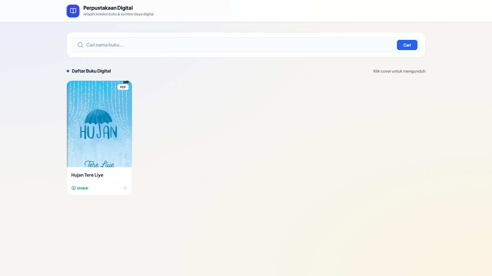
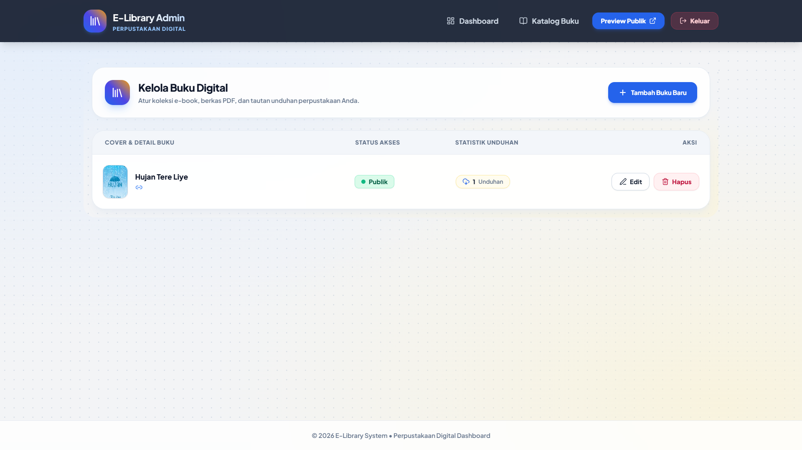
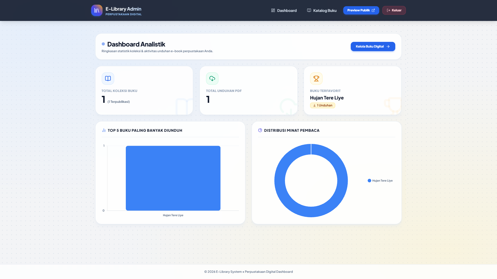
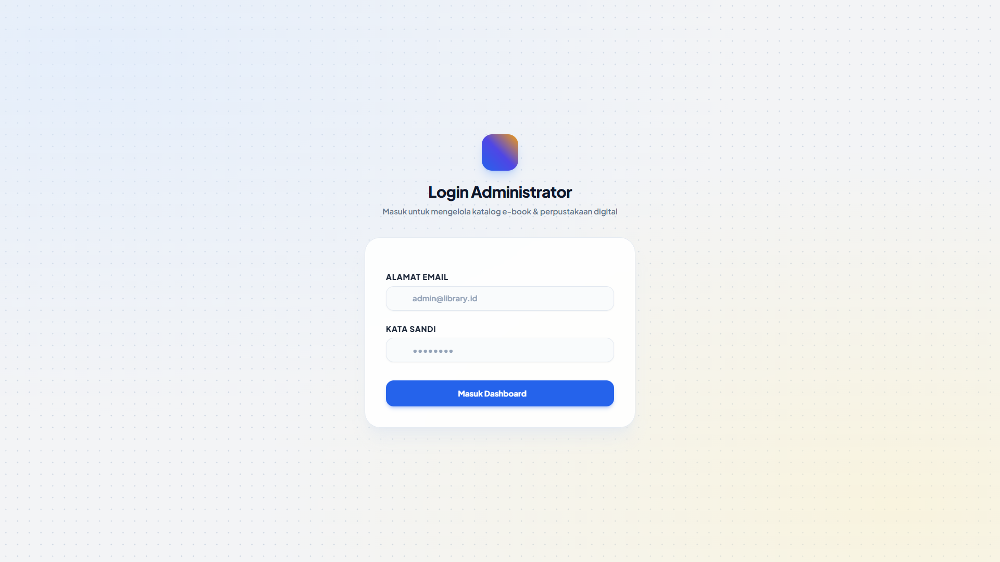

<<<<<<< HEAD
<div align="center">

  <!-- BADGES STATIS -->
  <p align="center">
    
    
    
    
  </p>

  <!-- LOGO & JUDUL -->
  <h1 align="center">📚 E-Library Digital System</h1>
  <p align="center">
    <b>Aplikasi Katalog & Unduh Buku Digital Berbasis Web</b>
    <br />
    <i>Sistem manajemen perpustakaan modern dengan fitur pengunggah e-book PDF dan antarmuka publik yang interaktif.</i>
  </p>

  ---
</div>

<br>

## 🧑‍💻 Informasi Pengembang

<table align="center" width="100%">
  <tr>
    <td width="20%" align="center"><b>Properti</b></td>
    <td width="80%"><b>Detail Identitas</b></td>
  </tr>
  <tr>
    <td align="center">👤 <b>Nama Lengkap</b></td>
    <td><b>Syahfiraz Hibatullah</b></td>
  </tr>
  <tr>
    <td align="center">🆔 <b>NIM</b></td>
    <td><code>2430511038</code></td>
  </tr>
  <tr>
    <td align="center">👥 <b>Kelompok</b></td>
    <td><b>Kelompok 2</b></td>
  </tr>
</table>

<br>

## 🌟 Fitur Utama Aplikasi

- 📖 **Katalog Digital Aesthetic**: Tampilan katalog publik responsive dengan pola grid card portrait ala sampul buku sungguhan.
- 🔍 **Pencarian Real-Time**: Pencarian nama buku cepat langsung dari sisi klien (*Client-side filtering*).
- 📥 **Unduh PDF Otomatis**: Integrasi pengunduhan berkas PDF langsung beserta sistem pencatatan statistik unduhan.
- 🛡️ **Panel Administrator Glassmorphism**: Dashboard analitik & manajemen data buku berdesain *presentation-ready* (kontras tinggi & latar belakang pola estetik).
- 🖼️ **Kustomisasi Sampul**: Pratinjau (*preview*) gambar sampul buku interaktif berbasis *Drag & Drop*.

<br>

## 📸 Tangkapan Layar (Screenshot)

Berikut adalah dokumentasi tampilan antarmuka sistem yang telah dikustomisasi:

### 🌐 1. Halaman Publik Katalog E-Book (`ss1.png`)
> Antarmuka utama publik yang menampilkan katalog buku digital dalam format grid portrait aesthetic lengkap dengan fitur pencarian nama buku.

<p align="center">
  
</p>

<br>

### ⚙️ 2. Halaman Kelola Buku Digital Admin (`ss2.png`)
> Panel daftar buku digital bagi administrator untuk menambahkan, memperbarui, atau menghapus berkas PDF dan sampul buku.

<p align="center">
  
</p>

<br>

### 📊 3. Halaman Dashboard Analistik (`ss3.png`)
> Ringkasan metrik statistik berupa total koleksi buku, total unduhan PDF, serta visualisasi grafik batang & lingkaran minat pembaca.

<p align="center">
  
</p>

<br>

### 🔐 4. Halaman Authentikasi Login Admin (`ss4.png`)
> Gerbang masuk administrator dengan desain *glassmorphism* modern dan validasi akses terproteksi.

<p align="center">
  
</p>

<br>

## 🛠️ Langkah Instalasi Proyek

1. **Kloning Repositori**:
   ```bash
   git clone [https://github.com/username/repository-name.git](https://github.com/username/repository-name.git)
   cd repository-name
=======
# bootcamp-E-learning-books-Syahfirazh
>>>>>>> f201de88ff7af7f4c64cabd3ba10d696d0db6204
